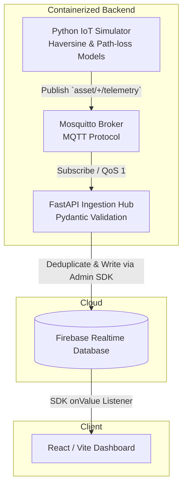

# Campus Asset Tracker

A real-time IoT asset-tracking dashboard for monitoring physical assets across a campus environment. The system is designed to track BLE-tagged assets through a multi-layer IoT pipeline and surface live location, status, and alert data through a web dashboard.

## Table of Contents
- [Problem Statement](#problem-statement)
- [Solution Overview](#solution-overview)
- [Functional Capabilities](#functional-capabilities)
- [System Architecture](#system-architecture)
- [Technical Stack](#technical-stack)
- [Quick Start](#quick-start)
- [Failure & Edge Case Handling](#failure--edge-case-handling)
- [Firebase RTDB & MQTT Examples](#firebase-rtdb--mqtt-examples)
- [Test Suite](#test-suite)
- [Configuration](#configuration)
- [Project Structure](#project-structure)

---

## Problem Statement

Campus Asset Tracker addresses the problem of physical asset loss, misuse, and unauthorised removal on large campuses. Each tracked asset carries a BLE beacon. A network of ESP32 gateways detects nearby beacons and forwards telemetry through LoRa to a central Raspberry Pi hub, which publishes data via MQTT to a FastAPI ingestion service. Firebase Realtime Database acts as the live data store, and a React web dashboard presents the data to administrators.

## Solution Overview

The project is currently a complete, fully functional software-simulated IoT pipeline. A mathematical simulator generates realistic hardware telemetry, which flows through a containerized backend into a React dashboard.

| Stage   | Description                                          | Status      |
|---------|------------------------------------------------------|-------------|
| Stage 1 | React/Firebase dashboard — inspection & stabilisation | ✅ Complete |
| Stage 2 | Python simulator producing simulated IoT telemetry    | ✅ Complete |
| Stage 3 | Simulator → Mosquitto MQTT adapter                    | ✅ Complete |
| Stage 4 | FastAPI ingestion service mapping MQTT to Firebase    | ✅ Complete |
| Stage 5 | Local integration & Docker Compose stack             | ✅ Complete |
| Stage 6 | Hardware layer (ESP32 BLE scanning, LoRa)             | 🔜 Planned  |

## Functional Capabilities

| Feature           | Status              | Notes                                                               |
|-------------------|---------------------|---------------------------------------------------------------------|
| Authentication    | ✅ Fully implemented | Firebase Auth (email/password). `AuthProvider` + `useAuth` hook.   |
| Live Map          | ✅ Fully implemented | Leaflet map with colour-coded asset markers using simulated live data. |
| Asset Registry    | ✅ Fully implemented | Searchable/filterable table using simulated live data from Firebase.|
| Gateway Health    | ✅ Fully implemented | Card grid with RSSI bars powered by the simulated backend.          |
| Alerts            | ✅ Fully implemented | Alert list with severity icons dynamically mapped to Firebase.      |

## System Architecture



## Technical Stack

| Layer         | Technology                                |
|---------------|-------------------------------------------|
| Frontend      | React 19, Vite 8                          |
| Simulator     | Python 3.12 (Haversine & Path-loss models)|
| Messaging     | MQTT (Eclipse Mosquitto)                  |
| Ingestion     | FastAPI, Pydantic, Paho-MQTT              |
| Deployment    | Docker & Docker Compose                   |
| Routing       | React Router DOM v7                       |
| Styling       | Vanilla CSS (custom dark design system)   |
| Maps          | Leaflet 1.9 + React-Leaflet 5             |
| Charts        | Recharts 3 (imported but not yet used)    |
| Icons         | Lucide React                              |
| Auth          | Firebase Authentication (email/password)  |
| Database      | Firebase Realtime Database                |
| Linting       | ESLint 9 (flat config)                    |
| Build         | Vite (Rolldown bundler)                   |

**Pending Hardware Implementation (Stage 6):** ESP32 firmware, LoRa driver, Raspberry Pi services.

## Quick Start

### Prerequisites
- [Docker](https://docs.docker.com/get-docker/) & Docker Compose
- Node.js 18+ (for the React Dashboard)

### 1. Start the Backend Stack
```bash
docker compose up -d
```
Check health:
```bash
curl http://localhost:8000/health
# Expected: {"status":"ok","mqtt":"connected","firebase":"initialized"}
```

### 2. Start the Frontend
```bash
npm install
npm run dev
# Opens at http://localhost:5173
```
*Note: Ensure `useMock=false` in the React hooks to consume live Firebase data.*

## Failure & Edge Case Handling

- **Idempotency & Deduplication:** MQTT QoS 1 guarantees "at least once" delivery, which can result in duplicate messages. The FastAPI Hub implements an in-memory LRU cache using a composite key (`assetId_timestamp`) to silently drop duplicate telemetry packets.
- **Defensive Data Validation:** Incoming MQTT payloads are strictly validated using Pydantic schemas. Battery values mathematically bounded outside `0-100%` are rejected, protecting the Firebase RTDB from malformed hardware packets.
- **Partial Database Updates:** The FastAPI Hub writes safely to Firebase using partial dictionary updates, ensuring manual UI metadata (like gateway zones) is preserved while IoT metrics (RSSI, battery) are seamlessly injected.

## Firebase RTDB & MQTT Examples

**MQTT Telemetry Topic:** `asset/{assetId}/telemetry`

**Firebase Realtime Database Schema:**
The frontend hooks expect the following schema. 

### `/assets/{assetId}`
```json
{
  "name":     "Laptop #L-22",
  "category": "Electronics",
  "location": "Eng Block",
  "status":   "online",
  "battery":  87,
  "lat":      11.0168,
  "lng":      76.9558
}
```
**Valid `status` values:** `online` | `alert` | `breach` | `idle`

### `/gateways/{gatewayId}`
```json
{
  "name":     "GW-01 Eng. Block",
  "status":   "online",
  "rssi":     -42,
  "lastPing": "5s ago",
  "zone":     "Eng Block"
}
```
**Valid `status` values:** `online` | `warning` | `offline`

## Test Suite

You can run the unit tests inside the pristine container environments via Docker Compose:
```bash
docker compose run --rm hub pytest tests/
docker compose run --rm simulator pytest tests/
```

## Configuration

### Firebase Credential Setup (Backend)
1. Download your Firebase Service Account JSON file.
2. Save it as `firebase-adminsdk.json` in the `secrets/` directory:
   ```text
   ASSET_TRACKER/
   └── secrets/
       └── firebase-adminsdk.json
   ```
*(Note: `secrets/` is ignored by Git, so your credentials remain safe).*

### Environment Variables (Frontend)
Create `.env.local` in the root (ignored by Git):
```env
VITE_FIREBASE_API_KEY=your_api_key
VITE_FIREBASE_AUTH_DOMAIN=your_project.firebaseapp.com
VITE_FIREBASE_DATABASE_URL=https://your_project-default-rtdb.firebaseio.com
VITE_FIREBASE_PROJECT_ID=your_project_id
VITE_FIREBASE_STORAGE_BUCKET=your_project.appspot.com
VITE_FIREBASE_MESSAGING_SENDER_ID=your_sender_id
VITE_FIREBASE_APP_ID=your_app_id
```

## Project Structure

```text
ASSET_TRACKER/
├── docker-compose.yml       # Orchestrates Mosquitto, Hub, and Simulator
├── package.json             # React Dashboard dependencies
├── src/                     # React Frontend Source
│   ├── components/
│   ├── hooks/
│   ├── pages/
│   └── lib/
├── hub/                     # FastAPI Ingestion Service
│   ├── main.py
│   ├── processor.py
│   ├── mqtt_handler.py
│   ├── firebase_client.py
│   ├── Dockerfile
│   └── tests/
├── simulator/               # Python IoT Telemetry Generator
│   ├── main.py
│   ├── movement.py
│   ├── ble.py
│   ├── Dockerfile
│   └── tests/
├── docker/                  # External Service Configs
│   └── mosquitto/
└── secrets/                 # Ignored Firebase credentials directory
```
